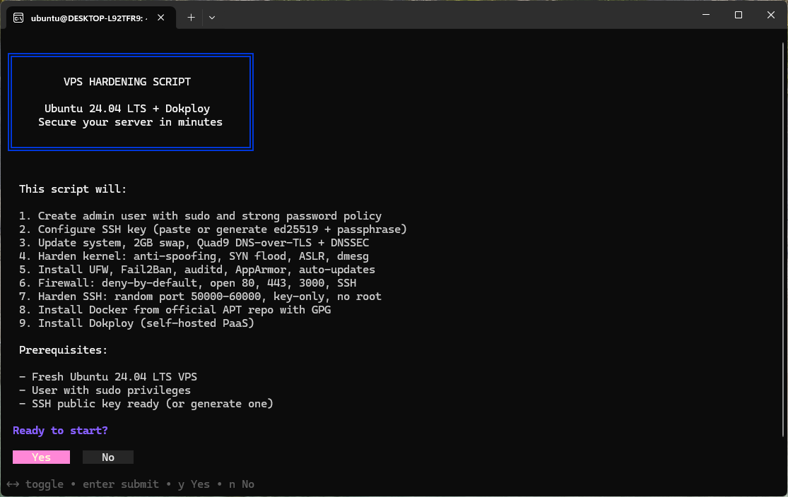

<p align="center">
  
  
  
  
</p>

<h1 align="center">VPS Hardening Script</h1>

<p align="center">
  <strong>Secure your Ubuntu 24.04 VPS and deploy Dokploy in minutes.</strong><br>
  One script. 9 steps. Production-ready server.<br><br>
  <a href="#quick-start">Quick Start</a> · <a href="#what-it-does">What It Does</a> · <a href="#security">Security</a> · <a href="#after-installation">Post-Install</a> · <a href="#faq">FAQ</a>
</p>

<p align="center">
  
</p>

---

### Why?

Most VPS come with a bare OS and no security. Hardening one manually takes hours and is easy to get wrong. This script does it all interactively, with a polished CLI powered by [gum](https://github.com/charmbracelet/gum), and deploys [Dokploy](https://dokploy.com) (self-hosted PaaS) on top.

---

## Quick Start

Connect to your VPS, switch to root, then run:

```bash
sudo -i
```

```bash
curl -sSL https://raw.githubusercontent.com/alexandreravelli/vps-hardening-script-ubuntu-24.04-LTS/main/setup.sh -o setup.sh && chmod +x setup.sh && ./setup.sh
```

> **Not root?** No worries -- the script detects this and auto-escalates with `sudo`.

---

## What It Does

**9 interactive steps** · **~10 minutes** · visual progress bar

```
[========            ] Step 4/9 -- Kernel hardening
```

| # | Step | What happens | Time |
|---|------|-------------|------|
| 1 | **User** | Create admin with sudo + strong password policy (12+ chars) | ~30s |
| 2 | **SSH Key** | Paste existing key or generate ed25519 with optional passphrase | ~10s |
| 3 | **System** | apt upgrade, 2GB swap, Quad9 DNS-over-TLS + DNSSEC, UTC timezone | ~2-3min |
| 4 | **Kernel** | sysctl: anti-spoofing, SYN flood protection, ASLR, dmesg restrict | ~5s |
| 5 | **Tools** | UFW, Fail2Ban, auditd, AppArmor, unattended-upgrades | ~1-2min |
| 6 | **Firewall** | UFW deny-by-default, allow custom SSH port + 80 + 443 + 3000 | ~5s |
| 7 | **SSH** | Random port 50000-60000, key-only auth, no root login | ~5s |
| 8 | **Docker** | Official APT repo + GPG + DOCKER-USER firewall (deny-by-default) | ~2-3min |
| 9 | **Dokploy** | Self-hosted PaaS, ready at `http://your-ip:3000` | ~1-2min |

> After step 9, the script asks you to **test your SSH connection** on the new port. Only after your confirmation (typing `CONFIRM`) will it close port 22 and disable password auth.

---

## Security

The script hardens **6 layers** of your server. Everything is automatic.

<details>
<summary><strong>SSH hardening</strong></summary>

| Feature | Details |
|---------|---------|
| Custom port | Random port 50000-60000 |
| Root login disabled | `PermitRootLogin no` |
| Key-only auth | Password auth disabled after confirmation |
| Brute-force protection | MaxAuthTries 3, LoginGraceTime 30s |
| Session control | ClientAliveInterval 300s, CountMax 2 |
| User whitelist | `AllowUsers` restricts to admin only |
| Forwarding disabled | X11 + TCP forwarding off |

</details>

<details>
<summary><strong>Network and firewall</strong></summary>

| Feature | Details |
|---------|---------|
| UFW firewall | deny-by-default, allow custom SSH port + 80 + 443 + 3000 |
| DOCKER-USER chain | deny-by-default for Docker containers, allow 80 + 443 + 3000 |
| Rate limiting | 6 connections/30s per IP on custom SSH port |
| Fail2Ban | 3 attempts = 1h ban |
| DNS-over-TLS | Quad9 (9.9.9.9) + DNSSEC |

</details>

<details>
<summary><strong>Kernel hardening</strong></summary>

| Feature | Details |
|---------|---------|
| Anti-spoofing | `rp_filter`, martian logging |
| SYN flood protection | `tcp_syncookies`, tuned backlog |
| ICMP hardening | Redirects + broadcasts blocked |
| ASLR | Full randomization (level 2) |
| Restricted info | dmesg + kernel pointers restricted |

</details>

<details>
<summary><strong>Authentication and monitoring</strong></summary>

| Feature | Details |
|---------|---------|
| Password policy | 12+ chars, mixed case, numbers, symbols |
| Audit logging | sudo, auth, SSH, user/group changes |
| AppArmor | Mandatory access control |
| Auto-updates | Daily security patches |

</details>

<details>
<summary><strong>Docker</strong></summary>

| Feature | Details |
|---------|---------|
| Official install | APT repo with GPG, not `curl \| sh` |
| Log rotation | 10MB max, 3 files |

</details>

<details>
<summary><strong>Recovery and safety</strong></summary>

| Feature | Details |
|---------|---------|
| Error trap | Restores SSH access on port 22 if setup fails |
| Config backup | `sshd_config.bak` saved before changes |
| Summary file | `~/.vps_setup_summary` with all details |
| Double confirmation | `CONFIRM` required before closing port 22 |
| No lockout | Password auth stays on until SSH key is verified |
| Log | Full log saved to `/var/log/vps_setup.log` |

</details>

---

## SSH Key Options

At step 2, you choose:

| Option | What happens |
|--------|-------------|
| **Paste existing key** | You paste your `ssh-ed25519` or `ssh-rsa` public key |
| **Generate new pair** | Script creates an ed25519 pair, displays the private key for you to save, installs the public key, then **securely deletes** the private key with `shred` |

> When generating a new key pair, the script asks if you want to **protect it with a passphrase**. Even if someone gets your private key file, they can't use it without the passphrase.

---

## After Installation

**Connect to your server:**

```bash
ssh your-user@your-ip -p YOUR_PORT
```

> Your SSH port and full connection command are saved in `~/.vps_setup_summary`.

**Remove default user:**

```bash
curl -sSL https://raw.githubusercontent.com/alexandreravelli/vps-hardening-script-ubuntu-24.04-LTS/main/cleanup.sh -o cleanup.sh && chmod +x cleanup.sh
sudo ./cleanup.sh          # interactive
sudo ./cleanup.sh ubuntu   # direct
```

**Run security audit:**

```bash
curl -sSL https://raw.githubusercontent.com/alexandreravelli/vps-hardening-script-ubuntu-24.04-LTS/main/check.sh -o check.sh && chmod +x check.sh
sudo ./check.sh
```

```
  [PASS] Root login disabled
  [PASS] Password authentication disabled
  [PASS] Custom SSH port: 54821
  ...
  PASS: 28  FAIL: 0  WARN: 1  TOTAL: 29
```

**Lock down Dokploy (after configuring SSL):**

The script already configures `DOCKER-USER` firewall rules (deny-by-default). After setting up your domain + SSL in Dokploy, close port 3000:

```bash
sudo iptables -D DOCKER-USER -p tcp --dport 3000 -j ACCEPT
sudo netfilter-persistent save
```

---

## Project Structure

```
.
├── setup.sh        # Main hardening script (interactive, gum UI)
├── cleanup.sh      # Remove old default user
├── check.sh        # Post-install security audit
├── LICENSE          # MIT
└── .github/
    ├── workflows/
    │   └── shellcheck.yml
    ├── ISSUE_TEMPLATE/
    │   ├── bug_report.md
    │   └── feature_request.md
    └── PULL_REQUEST_TEMPLATE.md
```

---

## Requirements

- Fresh **Ubuntu 24.04 LTS** VPS
- User with **sudo** privileges
- SSH public key ready (or let the script generate one)

> **Important:** If your VPS provider has an external firewall (OVH, Hetzner, AWS, etc.), you must **open the new SSH port** in their control panel after installation. The script assigns a random port between 50000-60000 -- make sure it's allowed before closing port 22.

---

## FAQ

<details>
<summary><strong>What if I lose my SSH key?</strong></summary>

Use your VPS provider's console/VNC access, then:

```bash
sudo nano /etc/ssh/sshd_config.d/hardening.conf
# Change PasswordAuthentication to yes
sudo systemctl restart ssh
```
</details>

<details>
<summary><strong>What if I forget my SSH port?</strong></summary>

Saved in two places -- access via your provider's console:
- `/root/.vps_hardening_config`
- `~/.vps_setup_summary`
</details>

<details>
<summary><strong>Can I run the script again?</strong></summary>

The script is designed for fresh installs. Use `check.sh` to verify your server's state instead.
</details>

<details>
<summary><strong>Can I skip Dokploy?</strong></summary>

Not currently. Comment out step 9 in `setup.sh` and remove port 3000 from the firewall rules.
</details>

<details>
<summary><strong>Does it work on other Ubuntu versions?</strong></summary>

Designed and tested for Ubuntu 24.04 LTS. May work on 22.04 but not guaranteed.
</details>

---

## Contributing

1. Fork the repo
2. Create a feature branch
3. Make sure `shellcheck -S warning your_script.sh` passes
4. Open a PR using the provided template

---

## License

MIT -- see [LICENSE](LICENSE)

<p align="center">
  <sub>Built with <a href="https://github.com/charmbracelet/gum">gum</a> by Charmbracelet</sub>
</p>
